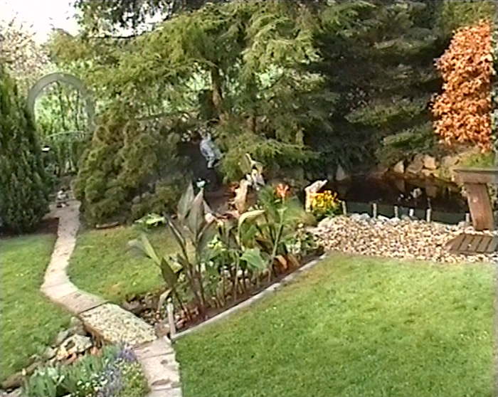

# nalsaifunc

My Vapoursynth functions.  

## EdgeChromaFix

Fixes color distortion on the right side of the video (found on Hi8 tapes from some Sony camcorders) by cropping the bad chroma V channel off and stretching the last good pixels of it. (This will not work well with colored object that appear only at the very edge.)

```python
EdgeChromaFix(clip, right=14, size=4)
```

| original | fixed |
|-|-|
| ||
